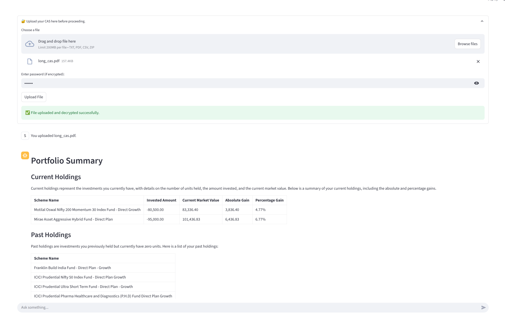

# CAS Analyzer

An intelligent AI-powered portfolio analysis system that extracts insights from Consolidated Account Statements (CAS) using advanced ETL workflows and tool-calling agent architecture.

## Features

### Portfolio Analysis
- **Automated CAS Processing**: Extract and parse encrypted CAS files with password protection
- **Real-time Portfolio Insights**: Get instant analysis of current holdings and past investments
- **Performance Metrics**: Calculate XIRR, absolute returns, and percentage gains
- **Asset Class Analysis**: Breakdown by market cap (Large, Mid, Small) and asset allocation

### Tool-Calling Agent Architecture
- **Intelligent Query Processing**: Natural language understanding for portfolio questions
- **Dynamic Tool Selection**: Automatic selection of appropriate analysis tools
- **Multi-session Support**: Isolated chat sessions with persistent state management
- **Real-time Calculations**: On-demand XIRR and performance calculations

### Conversational Interface
- **Natural Language Queries**: Ask questions in plain English
- **Context-Aware Responses**: AI understands portfolio context and provides relevant insights
- **Multi-lingual Support**: Support for multiple languages (planned)
- **Session Management**: Persistent chat history with file upload status

## Architecture

### ETL Workflow
```
CAS File Upload → Password Decryption → casparser Extraction → Data Processing → Portfolio Analysis
```

### Agent Architecture
```
User Query → LLM Reasoning → Tool Selection → Data Processing → Response Generation
```

## Technology Stack

- **Backend**: FastAPI, LangGraph, OpenAI GPT-4, SQLite
- **Frontend**: Streamlit, Plotly
- **Data Processing**: casparser, pandas, scipy

## Installation

### Prerequisites
- Python 3.11+
- Poetry (for dependency management)

### Setup
```bash
# Clone the repository
git clone <repository-url>
cd cas-analyzer

# Install dependencies
poetry install

# Set up environment variables
cp .env.example .env
# Edit .env with your OpenAI API key
```


## Usage

### Starting the Application

1. **Start the Backend API**:
```bash
poetry run uvicorn main:app --reload --port 8000
```

2. **Start the Frontend**:
```bash
poetry run streamlit run ui/chatbot.py
```

### Using the Application

1. **Upload CAS File**:
   - Navigate to the upload section
   - Select your encrypted CAS file
   - Enter the password if required
   - Click "Upload File"



2. **Ask Questions**:
   - Once uploaded, you can ask questions like:
     - "What's my portfolio summary?"
     - "Which fund has performed the best?"
     - "Show me my large-cap fund performance"
     - "What's my XIRR for equity funds?"
     - "Show asset class composition"

## Core Components

### 1. CAS ETL Workflow (`agents/cas_etl_workflow.py`)
- **File Processing**: Handles encrypted CAS file upload and decryption
- **Data Extraction**: Uses casparser to extract transaction data
- **Portfolio Analysis**: Generates current and past holdings summary
- **State Management**: Maintains session state with SQLite checkpointing

### 2. Portfolio Analyzer Agent (`agents/pf_analyzer_agent.py`)
- **Tool-Calling Architecture**: Dynamic tool selection based on user queries
- **Natural Language Processing**: Converts user questions to tool calls
- **Multi-turn Conversations**: Maintains context across conversation turns
- **Response Generation**: Provides structured, informative responses

### 3. Analysis Tools (`tools/`)
- **XIRR Calculator** (`xirr_tool.py`): Calculates internal rate of return
- **Transaction Filter** (`filter_transactions_tool.py`): Filters by ISIN, date, etc.
- **Asset Class Summary** (`cap_composition_tool.py`): Market cap analysis

### 4. Data Processing (`domain/cas_parser.py`)
- **CAS Parsing**: Extracts structured data from CAS files
- **Transaction Processing**: Handles various transaction types
- **Holdings Calculation**: Computes current and past holdings

## Supported Queries

- Calculate historical XIRR of my equity portfolio, including current and past schemes
- How has my HDFC hybrid fund performed?


## Acknowledgments

- [casparser](https://github.com/casparser/casparser) for CAS file parsing capabilities
